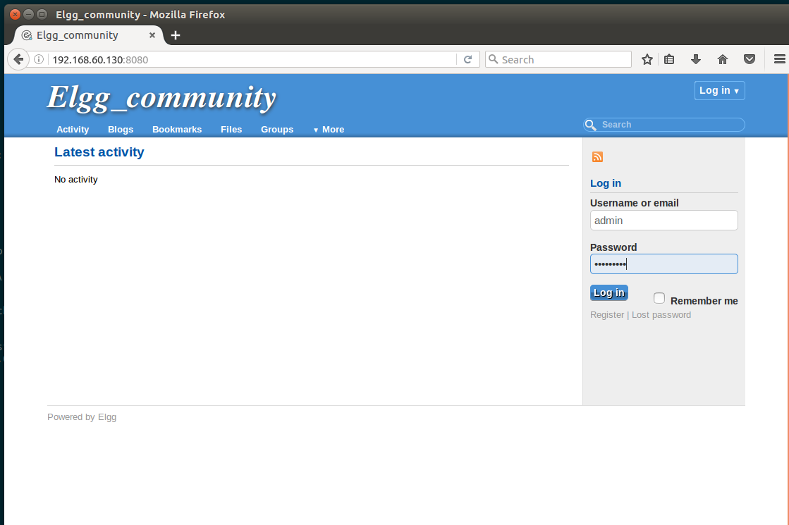

# Web-serving on vSphere Integrated Containers Engine

We take the Web-serving benchmark from CloudSuite (http://cloudsuite.ch/webserving/) as an example, to demonstrate how customers who are interested in the LEMP implementation of a web-serving application could deploy it on vSphere Integrated Containers Engine 0.7.0 using Docker Compose. This demo has three tiers deployed on three containerVMs: an Nginx Web server, a Memcached server, and a MySQL database server. The Web server runs Elgg (a social networking engine) and connects the Memcached server and the database server through the network.

## Workflow

### Build docker image for the Web server (on regular docker)

Note, in the original web-server docker image from Cloudesuite, the email verification for new user is not enabled.  This demo is here for illustration only. **You can also skip this section and proceed to "[Compose File for vSphere Integrated Containers Engine](#compose-file-for-vsphere-integrated-containers-engine)" if you do not want to build your own image**.

Step I: 
Download the original installation files from https://github.com/ParsaLab/cloudsuite/tree/master/benchmarks/web-serving/web_server

Step II:
In the Dockerfile, add “Run apt-get install –y sendmail” and “EXPOSE 25”

Step III:
Replace “bootstrap.sh” with the following:

```
#!/bin/bash
hname=$(hostname)
line=$(cat /etc/hosts | grep '127.0.0.1')
line2=" web_server web_server.localdomain"
sed -i "/\b\(127.0.0.1\)\b/d" /etc/hosts
echo "$line $line2  $hname" >> /etc/hosts
cat /etc/hosts
service sendmail stop
service sendmail start
service php5-fpm restart
service nginx restart
```
Step IV: (In this example, we will deploy the image to the docker hub.)
-	Build the image: 
```
$> docker build  -t repo/directory:tag . 
```
-	Login to your registry: (we use the default docker hub in this example) 
```
$> docker login (input your credentials when needed)
```
-	upload your image: 
```
$> docker push repo/directory:tag
```

### Build docker image for the MySQL server (on regular docker)

This example application uses the database to store the address of the Web server. The original Dockerfile from Cloudsuite populates this with "http://web_server:8080", which is not usable in production. Using the suggestions we provided earlier, we modify the execute.sh script to replace the "web_server" text with the actual IP of our VCH.  This script is executed when this database container is executed. In the Docker Compose file, we specify the IP address of our target VCH. You will see that in the modified compose yml file below. 

This example illustrates passing config in via environment variables and having the script use those values to modify internal config in the running container. Another option is to use a script and command line arguments to pass config to a containerized app. Below, we will modify the Dockerfile and script. . **You can also skip this section and proceed to "[Compose File for vSphere Integrated Containers Engine](#compose-file-for-vsphere-integrated-containers-engine)" if you do not want to build your own image**.

Step I: 
Download the original installation files from https://github.com/ParsaLab/cloudsuite/tree/master/benchmarks/web-serving/db_server

Step II:
In the Dockerfile, comment out the following lines:
```
ENV web_host web_server
RUN sed -i -e"s/HOST_IP/${web_host}:8080/" /elgg_db.dump
CMD bash -c "/execute.sh ${root_password}"
```

Step III:
Replace “files/execute.sh” with the following:

```
#!/bin/bash
set -x
service mysql restart
# Wait for mysql to come up
while :; do mysql -uroot -p${root_password} -e "status" && break; sleep 1; done

mysql -uroot -p$root_password -e "create database ELGG_DB;"
bash -c 'sed -i -e"s/HOST_IP/${web_host}:8080/" /elgg_db.dump'
cat /elgg_db.dump | grep 8080

# Need bash -c for redirection
bash -c "mysql -uroot -p$root_password ELGG_DB < /elgg_db.dump"

mysql -uroot -p$root_password -e "GRANT ALL PRIVILEGES ON *.* TO 'root'@'%' IDENTIFIED BY '$root_password' WITH GRANT OPTION; FLUSH PRIVILEGES;"

service mysql stop 
/usr/sbin/mysqld
```

Step IV: Same as Step IV when creating the docker image for the Web server.

### Compose File for vSphere Integrated Containers Engine
```
version: '2'

networks:
  my_net:
    driver: bridge

services:
  web_server:
    image: victest/web_elgg
    container_name: web_server
    networks:
       - my_net
    ports:
      - "8080:8080"

  mysql_server:
    image: victest/web_db
    container_name: mysql_server
    command: [bash, -c, "/execute.sh"]
    networks:
       - my_net
    environment:
       - web_host=192.168.60.130 # Replace this value with VCH_IP
       - root_password=root  # password for the root user
       
   memcache_server:
     image: cloudsuite/web-serving:memcached_server
     container_name: memcache_server
     networks:
       - my_net    
```

### Deploy to Your VCH

Once you already have a VCH deployed by vic-machine, go to the folder where you have the above “docker-compose.yml” file and execute the following command to start the Web-serving application:
```
$> docker-compose -H VCH_IP:VCH_PORT up –d
```
Here VCH_IP and VCH_PORT can be found from the standard output when you use “vic-machine create” to launch the VCH. Now we are ready to view the website. Open a browser and navigate to http://VCH_IP:8080. We make sure to use the IP address of the VCH we deployed on as the IP of our Web server here. You should be able to see the following page:


You can login in as the admin user (username: admin; password: admin1234), or register as a new user with a valid email address (Gmail does not work). You can also create your own content, invite friends, or chat with others. Enjoy! 


